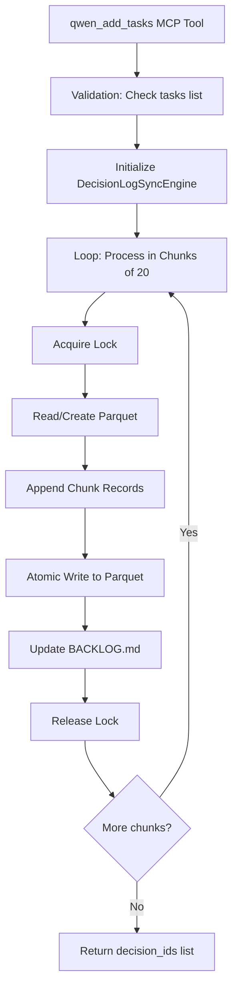

# Plan Wdrożenia: Batch Task Creation dla `qwen_add_tasks`

## Cel
Dodać nowe narzędzie MCP `qwen_add_tasks` umożliwiające masowe dodawanie zadań do BACKLOG.md i decision_log.parquet z chunkingiem dla uniknięcia timeout.

---

## Architektura



---

## Zmiany w Plikach

### 1. `src/qwen_mcp/engines/decision_log_sync.py`

#### Dodaj nową metodę `add_tasks` (plural) po metodzie `add_task`:

```python
async def add_tasks(
    self,
    tasks: List[Dict[str, Any]],
    backlog_path: Path,
    workspace_root: str,
    session_id: str = "sos_manual",
    decision_type: str = "manual_task",
    chunk_size: int = 20
) -> List[str]:
    """
    Add multiple tasks to BACKLOG.md and decision_log.parquet in batches.
    
    Args:
        tasks: List of task dictionaries with keys:
            - task_name (required)
            - advice (required)
            - complexity (optional, default: "medium")
            - tags (optional)
            - risk_score (optional, default: 0.0)
        backlog_path: Path to BACKLOG.md
        workspace_root: Workspace root path
        session_id: Session identifier
        decision_type: Type of decision
        chunk_size: Number of tasks per batch write (default: 20)
    
    Returns:
        List of decision_ids for all created tasks
    """
    from datetime import datetime
    import uuid
    import asyncio
    
    decision_ids = []
    total_tasks = len(tasks)
    
    for i in range(0, total_tasks, chunk_size):
        chunk = tasks[i:i + chunk_size]
        chunk_records = []
        
        # Create records for this chunk
        timestamp = datetime.now()
        for task in chunk:
            decision_id = str(uuid.uuid4())
            decision_ids.append(decision_id)
            
            record = {
                "decision_id": decision_id,
                "timestamp": timestamp,
                "session_id": session_id,
                "decision_type": decision_type,
                "task_type": "pending",
                "complexity": task.get("complexity", "medium"),
                "tokens_used": 0,
                "content": f"Task: {task['task_name']}",
                "tags": task.get("tags", []),
                "backlog_ref": task["task_name"],
                "context_version": "1.0",
                "patch_applied": False,
                "agentic_advice": task["advice"],
                "risk_score": task.get("risk_score", 0.0),
                "validator_triggers": [],
                "user_approval": None,
                "rationale": f"Batch added task: {task['task_name']}",
                "adr_status": None,
                "adr_context": None,
                "adr_consequences": None,
                "adr_alternatives": None,
                "linked_code_nodes": [],
                "depends_on_adr": []
            }
            chunk_records.append(record)
        
        # Write chunk to parquet with lock
        def write_chunk():
            lock = self._acquire_lock()
            try:
                # Read existing or create empty
                if self.decision_log_path.exists():
                    table = pq.read_table(str(self.decision_log_path))
                    records = table.to_pylist()
                else:
                    records = []
                
                # Append chunk records
                records.extend(chunk_records)
                
                # Atomic write
                from decision_log.decision_schema import DECISION_LOG_SCHEMA
                fd, temp_path = tempfile.mkstemp(suffix=".parquet", dir=str(self.decision_log_path.parent))
                os.close(fd)
                updated_table = pa.Table.from_pylist(records, schema=DECISION_LOG_SCHEMA)
                pq.write_table(updated_table, temp_path)
                os.replace(temp_path, str(self.decision_log_path))
            finally:
                self._release_lock()
        
        await asyncio.to_thread(write_chunk)
        
        # Small delay between chunks to avoid timeout
        if i + chunk_size < total_tasks:
            await asyncio.sleep(0.1)
    
    # Update BACKLOG.md once at the end with all tasks
    await self._add_tasks_to_backlog(backlog_path, tasks, decision_ids)
    
    return decision_ids


async def _add_tasks_to_backlog(
    self,
    backlog_path: Path,
    tasks: List[Dict[str, Any]],
    decision_ids: List[str]
) -> None:
    """
    Helper to add multiple tasks to BACKLOG.md under ## Pending section.
    
    Args:
        backlog_path: Path to BACKLOG.md
        tasks: List of task dictionaries
        decision_ids: List of corresponding decision IDs
    """
    if not backlog_path.exists():
        backlog_path.parent.mkdir(parents=True, exist_ok=True)
        backlog_content = "# BACKLOG\n\n## Pending\n\n"
    else:
        with open(backlog_path, 'r', encoding='utf-8') as f:
            backlog_content = f.read()
    
    # Find "## Pending" section
    pending_match = re.search(r'^## Pending\s*$', backlog_content, re.MULTILINE)
    if not pending_match:
        # Create Pending section
        backlog_content += "\n## Pending\n\n"
        insert_pos = len(backlog_content)
    else:
        insert_pos = pending_match.end()
    
    # Add tasks
    tasks_content = ""
    for task, decision_id in zip(tasks, decision_ids):
        safe_name = task["task_name"].replace('\n', ' ').replace('\r', ' ')[:200]
        tasks_content += f"- [ ] {safe_name} - {decision_id}\n\n"
    
    # Insert tasks after ## Pending
    new_content = backlog_content[:insert_pos] + "\n" + tasks_content + backlog_content[insert_pos:]
    
    with open(backlog_path, 'w', encoding='utf-8') as f:
        f.write(new_content)
```

---

### 2. `src/qwen_mcp/tools.py`

#### Dodaj nową funkcję `add_tasks_to_backlog_batch`:

```python
async def add_tasks_to_backlog_batch(
    tasks: List[Dict[str, Any]],
    workspace_root: str,
    session_id: str = "sos_manual",
    decision_type: str = "manual_task",
    chunk_size: int = 20
) -> str:
    """
    Add multiple tasks from natural language to BACKLOG.md and decision_log.parquet.
    
    This is the batch version of add_task_to_backlog.
    
    Args:
        tasks: List of task dictionaries with keys:
            - task_name (required)
            - advice (required)
            - complexity (optional, default: "medium")
            - tags (optional)
            - risk_score (optional, default: 0.0)
        workspace_root: Workspace root path
        session_id: Session identifier (default: "sos_manual")
        decision_type: Type of decision (default: "manual_task")
        chunk_size: Number of tasks per batch (default: 20)
    
    Returns:
        Confirmation message with count of added tasks
    """
    from pathlib import Path
    from qwen_mcp.engines.decision_log_sync import DecisionLogSyncEngine
    
    decision_log_path = DEFAULT_SOS_PATHS.get_decision_log_path(workspace_root)
    backlog_path = DEFAULT_SOS_PATHS.get_backlog_path(workspace_root)
    
    engine = DecisionLogSyncEngine(decision_log_path)
    
    try:
        decision_ids = await engine.add_tasks(
            tasks=tasks,
            backlog_path=backlog_path,
            workspace_root=workspace_root,
            session_id=session_id,
            decision_type=decision_type,
            chunk_size=chunk_size
        )
        
        return f"✅ Added {len(decision_ids)} tasks to BACKLOG.md\n\nDecision IDs: {', '.join(decision_ids[:5])}{'...' if len(decision_ids) > 5 else ''}"
    except ValueError as e:
        return f"❌ Error adding tasks: {str(e)}"
    except Exception as e:
        return f"❌ Unexpected error: {str(e)}"
```

---

### 3. `src/qwen_mcp/server.py`

#### Dodaj nowe narzędzie MCP `qwen_add_tasks`:

```python
@mcp.tool()
async def qwen_add_tasks(
    tasks: List[Dict[str, Any]],
    workspace_root: str = ".",
    session_id: str = "sos_manual",
    decision_type: str = "manual_task",
    chunk_size: int = 20,
    ctx: Context = None
) -> str:
    """
    Add multiple tasks from natural language to BACKLOG.md and decision_log.parquet.
    
    This is the batch version of qwen_add_task for handling large task lists.
    Processes tasks in chunks to avoid MCP timeout.
    
    Args:
        tasks: List of task dictionaries with keys:
            - task_name (required): Human-readable task name
            - advice (required): The agentic advice/recommendation
            - complexity (optional): Task complexity (default: "medium")
            - tags (optional): Tags list
            - risk_score (optional): Risk assessment (default: 0.0)
        workspace_root: Path to workspace root (default: ".")
        session_id: Session identifier (default: "sos_manual")
        decision_type: Type of decision (default: "manual_task")
        chunk_size: Number of tasks per batch write (default: 20)
        ctx: MCP context for progress reporting
    
    Returns:
        Confirmation message with count of added tasks
    """
    await _auto_init_request(ctx, "add_tasks")
    project_id = _get_tool_session_id(ctx, default_source="add_tasks")
    
    # Report progress FIRST
    if ctx:
        await ctx.report_progress(
            progress=0,
            total=len(tasks),
            message=f"Adding {len(tasks)} tasks to backlog..."
        )
    
    # Broadcast for UI visibility
    await get_broadcaster().broadcast_state({
        "operation": f"Adding {len(tasks)} tasks to backlog...",
        "progress": 0.0,
        "is_live": True
    }, project_id=project_id)
    
    from qwen_mcp.tools import add_tasks_to_backlog_batch
    
    result = await add_tasks_to_backlog_batch(
        tasks=tasks,
        workspace_root=workspace_root,
        session_id=session_id,
        decision_type=decision_type,
        chunk_size=chunk_size
    )
    
    # Update progress on completion
    if ctx:
        await ctx.report_progress(
            progress=len(tasks),
            total=len(tasks),
            message="Tasks added successfully"
        )
    
    await get_broadcaster().broadcast_state({
        "operation": "Tasks added to backlog",
        "progress": 100.0,
        "is_live": False
    }, project_id=project_id)
    
    return result
```

---

## Test Plan

### Test 1: Empty Tasks List
```python
result = await add_tasks_to_backlog_batch(tasks=[], workspace_root=".")
assert "0 tasks" in result
```

### Test 2: Single Task
```python
tasks = [{"task_name": "Test", "advice": "Test advice"}]
result = await add_tasks_to_backlog_batch(tasks=tasks, workspace_root=".")
assert "1 tasks" in result
```

### Test 3: Multiple Tasks (Under Chunk Limit)
```python
tasks = [{"task_name": f"Task {i}", "advice": f"Advice {i}"} for i in range(10)]
result = await add_tasks_to_backlog_batch(tasks=tasks, workspace_root=".")
assert "10 tasks" in result
```

### Test 4: Multiple Chunks
```python
tasks = [{"task_name": f"Task {i}", "advice": f"Advice {i}"} for i in range(50)]
result = await add_tasks_to_backlog_batch(tasks=tasks, workspace_root=".", chunk_size=20)
assert "50 tasks" in result
# Verify 3 chunks were processed (20 + 20 + 10)
```

### Test 5: Missing Files (New Project)
```python
# Delete existing files
if decision_log_path.exists():
    decision_log_path.unlink()
if backlog_path.exists():
    backlog_path.unlink()

tasks = [{"task_name": "First Task", "advice": "First advice"}]
result = await add_tasks_to_backlog_batch(tasks=tasks, workspace_root=".")
assert decision_log_path.exists()
assert backlog_path.exists()
```

---

## Roadmap

1. **Faza 1: Implementacja Core**
   - [ ] Dodaj `add_tasks()` do `decision_log_sync.py`
   - [ ] Dodaj `_add_tasks_to_backlog()` helper
   - [ ] Dodaj `add_tasks_to_backlog_batch()` do `tools.py`

2. **Faza 2: MCP Tool**
   - [ ] Dodaj `qwen_add_tasks()` do `server.py`
   - [ ] Dodaj progress reporting
   - [ ] Dodaj broadcast dla UI

3. **Faza 3: Testy**
   - [ ] Test z pustą listą
   - [ ] Test z pojedynczym zadaniem
   - [ ] Test z wieloma zadaniami (< 20)
   - [ ] Test z wieloma chunkami (> 20)
   - [ ] Test z brakującymi plikami (nowy projekt)

4. **Faza 4: Dokumentacja**
   - [ ] Zaktualizuj `.context/_PROJECT_CONTEXT.md`
   - [ ] Dodaj przykład użycia w docs/

---

## Ryzyka i Mitigacja

| Ryzyko | Prawdopodobieństwo | Wpływ | Mitigacja |
|--------|-------------------|-------|-----------|
| Timeout MCP przy dużych batchach | Średnie | Wysoki | Chunk size 20, sleep między chunkami |
| Race condition przy lock | Niskie | Średni | Testy z concurrent access |
| Uszkodzenie parquet przy błędzie | Niskie | Wysoki | Atomic write z tempfile + os.replace |
| Backward compatibility | Niskie | Niski | Zachowaj oryginalny `qwen_add_task` |

---

## Metryki Sukcesu

- [ ] `qwen_add_tasks` przyjmuje listę 150 zadań bez timeout
- [ ] Postęp widoczny w UI co chunk
- [ ] Wszystkie decision_ids zwrócone poprawnie
- [ ] BACKLOG.md i parquet zsynchronizowane
- [ ] Nowy projekt (bez plików) obsłużony poprawnie
