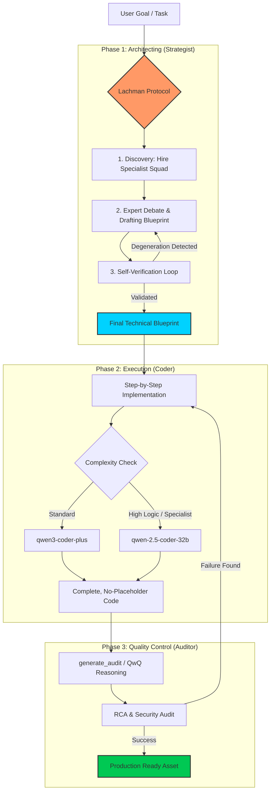

# The Lachman Protocol: Qwen Engineering Engine

[](https://github.com/)
[](https://opensource.org/licenses/MIT)
[](https://www.python.org/downloads/)
[](#)
[](#)

**Stop building apps by trial and error. Start shipping them by design.**

By offloading heavy architectural planning and raw coding to specialized Qwen models, you stop the "two steps forward, one step back" dance and start delivering finished applications.

**[🚀 See the Lachman Protocol Storyboard in action!](./docs/EXAMPLE.md)**

### This is NOT for you if:
- You just want an AI to chat with or write your emails.
- You enjoy manually copy-pasting code because you don't trust agents.
- You have an unlimited budget to blow $50/day on "lazy" models that truncate your code with `// ... implementation here`.

### This IS for you if:
- You are a **"Vibecoder"** (building complex apps primarily via AI chat) and you're sick of the "Fix one feature, break two others" cycle.
- You're a **Senior Developer** who wants to delegate the "dirty work"—auditing logs, writing boilerplate, and complex refactoring—to an agent that won't get tired or impatient.
- You want the power of **Qwen 3.5 Plus** and **Qwen 2.5 Coder 32B** at a **fraction of the cost** of GPT-4o or Claude 3.5 Opus.

---

## Why the hell Qwen, not Sonnet nor Gemini?
Simply put: the SRE/Coding capabilities of the customized Qwen models (like Qwen 3.5 Plus and Qwen 2.5 Coder 32B) combined with Alibaba DashScope pricing give you an unmatched ROI. You're getting near-frontier reasoning at a fraction of the cost. This makes it viable to run entire "Expert Squads" (The Lachman Protocol) working on your code simultaneously. No more stressing about hitting a usage limit or spending $50/day.

---

## The Problem: The "Lazy AI" Ceiling
Current flagship assistants are great, but they have major flaws when tasked with building real software:
1. **Context Amnesia:** They forget your core requirements 10 messages into a debug session.
2. **The Placeholder Trap:** They get lazy and give you snippets instead of functional files.
3. **Hallucination Cascades:** One small error leads to a chain of patches that eventually breaks the entire architecture.

**The Lachman Protocol solves this by hiring Qwen as your "Project Architect & Senior SRE".**

---

## The Core: The Lachman Protocol (LP)
When you initiate a project, the engine doesn't just "guess." It enters a multi-stage **Self-Healing Loop**:

1. **Discovery:** Qwen hires a virtual "Expert Squad" tailored to your specific goal (e.g., Security Auditor, Backend Engineer, UX Strategist).
2. **Architecting:** These roles debate and produce a **Detailed Project Blueprint**. 
3. **Self-Verification:** A separate "Verifier" model audits the blueprint. If it finds a flaw, the engine triggers a self-correction loop (up to 3 times) to fix the design *before* any code is written.

### The result? 
You get a surgical Technical Roadmap. Your primary assistant (Claude/Antigravity) acts as the **Commander**, while the Qwen Engine handles the **Heavy Logistics**.

### ⛓️ The Shackle: TDD-First implementation
A blueprint is only as good as its verification. The Lachman Protocol is most effective when combined with a **TDD-First Workflow**:
- **Faza RED**: Write a failing test for the new feature BEFORE calling the Coder.
- **Faza GREEN**: Use `qwen_coder` to satisfy the failing test.
- **Faza REFACTOR**: Use `qwen_audit` to clean up the code.

**Without a failing test, the Architect's plan remains a theory. With TDD, it becomes an inevitable reality.**

---

## Scenario: From Idea to Reality

### Phase 1: Planning without Hallucination
Instead of saying: *"Build me a CRM"*, you tell your assistant:
> "Plan a CRM with FastAPI and Postgres. **Call `qwen_architect`** to generate the blueprint."

**Result:** You get a structured Roadmap + Security Audit + Risk Assessment.

### Phase 2: Full-Scale Implementation / Refactoring
Don't let your main assistant guess the syntax or "hallucinate" the logic. 
> "Take Step 1 of the blueprint and **call `qwen_coder`** to implement the models and database connection. Ensure the logic is complete."

**You can also use it for precise atomic tasks:**
> "In file `auth.py`, **call `qwen_coder`** to refactor the login function to use JWT instead of sessions. Do not use placeholders."

**Result:** You get 100% complete, working Python code. No truncated files, no "implement here" comments.

> "Here are my logs and current file. **Call `qwen_audit`** to find the root cause and fix it."

**Result:** A Senior SRE analysis that finds the memory leak or the null pointer in seconds.

---

## Performance & Strategy

### We don't need Ralph
There is a popular method called **The Ralph Loop** (fresh context for every iteration). While interesting for naive agents, the Qwen Engineering Engine is designed differently. 

Because we use **The Lachman Protocol** (Spec -> Code -> Audit), we rely on **State & Blueprint Persistence** rather than a fresh start. We can tell Ralph to stay in Springfield—we have an Architect in the basement.

---

## The Arsenal (Dynamic 5-Role Registry)

The engine automatically selects the best model for each task via **Qwen-Turbo Meta-Analysis** to ensure maximum ROI and capability.

| Category | Tool | Role/Role | Default Model (SOTA) |
| :--- | :--- | :--- | :--- |
| **Logic** | `qwen_architect` | **Strategist**: Expert planner & JSON architect. | `qwen3.5-plus` |
| **Code** | `qwen_coder` | **Coder**: Writing production-grade complete files. | `qwen3-coder-plus` |
| **Code** | `qwen_coder_25` | **Specialist**: Expert in complex logic & Refactoring. | `qwen3-coder-next` |
| **SRE** | `qwen_audit` | **Analyst**: Reason-heavy SRE/Debugging (QwQ). | `qwq-plus` |
| **Data** | `qwen_read_file` | **Scout**: Context discovery and fast summaries. | `qwen-flash` |
| **Data** | `qwen_list_files` | **Explorer**: Map project structure. | `qwen-flash` |
| **Admin** | `qwen_usage_report`| **Billing**: Token/Cost report from DuckDB. | N/A |
| **Logic** | `qwen_refresh_models`| **Intelligence**: Trigger meta-analysis update. | `qwen-turbo` |
| **Logic** | `qwen_set_model` | **Manual**: Override a role assignment. | User Defined |
| **Logic** | `qwen_list_available_models`| **Discovery**: List all models from your API key. | N/A |

---

## 🧠 The Engineering Squad: Under the Hood

The Qwen Engineering Engine works because it doesn't treat coding as a "text completion" task. It treats it as an **orchestrated engineering process** where specialized roles keep each other in check.



### 🏛️ The Architect (The Strategist)
**Logic:** `qwen_architect` / **Model:** `qwen3.5-plus`
The Architect doesn't just write a list of steps. It initiates the **Lachman Protocol v2.5**:
1.  **Discovery Phase:** Qwen analyzes your goal and "hires" 1-3 virtual experts (e.g., *Senior Security Lead*, *Scalability Architect*).
2.  **Expert Swarm:** These experts debate the best implementation path using the **80/20 Pareto Principle**—designing the core 80% MVP while explicitly rejecting "gold plating" (over-engineering).
3.  **Self-Healing Circuit:** Before you see the result, a separate **Verifier** model audits the blueprint for "degeneration" (placeholders, logical gaps). If it fails, the engine autonomously retries to fix the design.
*   **Output:** A high-precision JSON Blueprint with a TDD-first roadmap and "Clean Slate" instructions (what to delete).

### 🛠️ The Coder (The Implementation)
**Logic:** `qwen_coder` / `qwen_coder_25` / **Model:** `qwen3-coder-plus` or `qwen3-coder-next`
The Coder is bound by strict **Surgicial Precision Rules**:
-   **No Placeholders:** A absolute ban on `// ... rest of code`. Every file is generated in full or as a clean, integrable block.
-   **Context Awareness:** It consumes the Architect's blueprint to stay aligned with the big picture.
-   **Model Switching:** For simple boilerplate, it uses standard coder models. For complex algorithms or heavy refactoring, it escalation to `qwen-2.5-coder-32b` (Coder-Next) for maximum logic density.

### 🔍 The Auditor (The Analyst)
**Logic:** `qwen_audit` / **Model:** `qwq-plus`
The Auditor uses **heavy reasoning (QwQ)** to act as a Senior SRE (Site Reliability Engineer):
-   **Root Cause Analysis (RCA):** Feed it terminal logs, and it will find the exact line causing the memory leak or dependency conflict.
-   **Brevity & ROI:** It doesn't nitpick code style. It focuses on high-impact fixes, security vulnerabilities, and edge cases that simpler models miss.
-   **Zero Fluff:** You get actionable feedback and specific code blocks to fix, nothing more.

---

## Transparent ROI & Financial Shield
We don't guess if the models are efficient. We track it locally using DuckDB. If a session enters a hallucination loop, the **Financial Circuit Breaker** terminates the process before it drains your wallet.

Here is a real example of an entire afternoon spent orchestrating the 5-role squad to refactor this very engine:

| Model | Prompts | Completions | Total Tokens |
|---|---|---|---|
| **qwen-flash** (Scout) | 3,946 | 1,853 | **5,799** |
| **qwen3-coder-next** (Specialist) | 920 | 2,638 | **3,558** |
| **qwen3-coder-plus** (Coder)| 1,150 | 1,223 | **2,373** |
| **qwen3.5-plus** (Strategist) | 952 | 1,254 | **2,206** |
| **qwq-plus** (Analyst) | 721 | 3,313 | **4,034** |
| **TOTAL TODAY** | **7,689** | **10,281** | **~17,970 tokens** |

*Cost for a full SRE squad rewriting your codebase? Fractions of a cent on DashScope. You can pull this exact report anytime via the `qwen_usage_report` tool.*

---

## Critical: AI Assistant Configuration

To get the most out of the Qwen Engineering Engine, you **MUST** provide your primary assistant (Claude/Antigravity/Cursor) with the operational logic and follow the mandatory quality protocols.

1.  **System Instructions**: Copy the contents of **[LP_SYSTEM_PROMPT.md](./docs/LP_SYSTEM_PROMPT.md)** into your **Custom Instructions**, **.cursorrules**, or **Project Rules**.
2.  **Quality Protocol**: Study and follow the **[TDD Shackle Guide](./docs/TDD.md)**. 
3.  **Repair Protocol**: Use the **[Audit Triad](./docs/REPAIR_PROTOCOL.md)** for debugging and fixing regressions.
4.  **Real-World Example**: See how it all works together in the **[Lachman Protocol Simulation](./docs/EXAMPLE.md)** (Architecting -> TDD -> Code -> Audit -> Backlog).

Without these steps, your primary assistant will not know how to orchestrate the specialized Qwen experts, and you risk falling into the "Hallucination Trap".

### 📋 Continuous Improvement: Backlog Protocol
The Lachman Protocol doesn't stop at deployment. For heavy projects, we use a mandatory **Backlog Workflow**:
-   Any insight or secondary task found during a `qwen_audit` is immediately registered via the **[Backlog Protocol](./.agent/workflows/TBLG_To_backlog.md)**.
-   This ensures your project has a "memory" beyond the current chat context.

---

## Installation & Setup

### 0. Required Tools
- **Antigravity, Claude Desktop, Cursor**, etc.
- **QWEN API KEY** (via Alibaba DashScope).
- **Brain** - even this tool requires PI (Protein Intelligence). It is as intelligent as your interaction with it... Do not expect wonders after typing "write an email for me".

### 1. Get a DashScope API Key
*What is DashScope?* It's Alibaba Cloud's native platform for serving Qwen models. By pulling directly from Alibaba, you get the absolute lowest prices and maximum rate limits.
1. Create an account on Alibaba Cloud / DashScope.
2. Claim your free tier/trial tokens.
3. Generate your `DASHSCOPE_API_KEY`.
*(Alternatively, you can use OpenRouter, but be prepared to pay their markup fees).*

### 2. Local Development Setup (Quick Start)
Since the package is in development, install it in editable mode:

```bash
git clone <this-repo-url>
cd qwen-coding-engine
uv pip install -e .
```

### 2. Configure Environment
Create a `.env` file or set the following variables:
```bash
export DASHSCOPE_API_KEY=your_key_here
# Optional: for local mode
# export OLLAMA_BASE_URL=http://localhost:11434/v1
```

### 3. Let your AI do the work (Recommended)
Don't waste time manually editing config files. Just copy the prompt from **[INSTALL_MCP.md](./docs/INSTALL_MCP.md)** and paste it into your AI assistant. It will handle the registration and paths for you.

*Manual configuration block for reference:*
```json
{
  "mcpServers": {
    "qwen-coding": {
      "command": "uv",
      "args": [
        "--directory",
        "C:\\absolute\\path\\to\\qwen-coding-engine",
        "run",
        "qwen-coding-engine"
      ],
      "env": {
        "DASHSCOPE_API_KEY": "your_api_key",
        "LP_MAX_RETRIES": "3"
      }
    }
  }
}
```

---
**License: MIT**  
**Build apps, not just conversations.**

---

### 🛡️ Why "Lachman Protocol"?
You might notice the name – yes, it's my surname.

Before you think this is about a massive ego: the story is much simpler. I had the core idea at 2 AM. I needed to name the file something unique so it wouldn't get lost in a sea of hundreds of other "temp_logic_v2" files. My brain was too tired to think of a fancy brand name, so "Lachman Project" was the first thing that came to mind.

And so it stayed. My flattered ego says hello! 😁

---

### Post Scriptum
> I'm not gonna pretend this was all hand-written. Actually, the best part about this repo is that from the MVP stage it basically built itself using its own protocol. It’s living proof that the engine actually works.
> 
> The real work wasn't the 2 days the AI spent creating the files. It was the months of thinking, failing, and figuring out how to stop these models from hallucinating in the first place.
> 
> Honestly, the only files I manually tweaked were the README and the SYSTEM_PROMPT. The Qwen engine + Antigravity wrote the rest, QwQ audited it, and it runs flawlessly out of the box.
> 
> Couldn't ask for a better Proof of Concept tbh.
