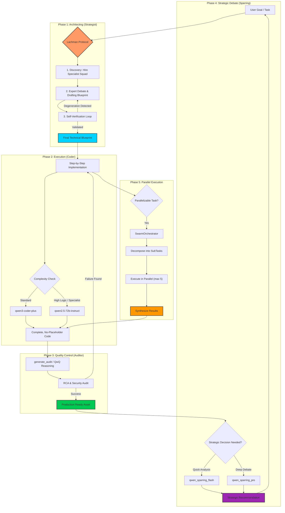

# The Lachman Protocol: Qwen Engineering Engine

[](https://github.com/)
[](https://opensource.org/licenses/MIT)
[](https://www.python.org/downloads/)
[](#)
[](#)

**Stop building apps by trial and error. Start shipping them by design.**

By offloading heavy architectural planning and raw coding to specialized Qwen models, you stop the "two steps forward, one step back" dance and start delivering finished applications.

**Version:** 1.1.1 | **License:** MIT | **Python:** 3.10+

**[ See the Lachman Protocol Storyboard in action!](./docs/EXAMPLE.md)**

### This is NOT for you if:
- You just want an AI to chat with or write your emails.
- You enjoy manually copy-pasting code because you don't trust agents.
- You have an unlimited budget to blow $50/day on "lazy" models that truncate your code with `// ... implementation here`.

### This IS for you if:
- You are a **"Vibecoder"** (building complex apps primarily via AI chat) and you're sick of the "Fix one feature, break two others" cycle.
- You're a **Senior Developer** who wants to delegate the "dirty work"—auditing logs, writing boilerplate, and complex refactoring—to an agent that won't get tired or impatient.
- You want the power of **Qwen 3.5 Plus** (strategist) and **Qwen 3 Coder Plus** (coding) at a **fraction of the cost** of GPT-4o or Claude 3.5 Opus.

---

## Why the hell Qwen, not Sonnet nor Gemini?
Simply put: the SRE/Coding capabilities of the customized Qwen models (like Qwen 3.5 Plus and Qwen 2.5 Coder 32B) combined with Alibaba DashScope pricing give you an unmatched ROI. You're getting near-frontier reasoning at a fraction of the cost. This makes it viable to run entire "Expert Squads" (The Lachman Protocol) working on your code simultaneously. No more stressing about hitting a usage limit or spending $50/day.

---

## The Problem: The "Lazy AI" Ceiling
Current flagship assistants are great, but they have major flaws when tasked with building real software:
1. **Context Amnesia:** They forget your core requirements 10 messages into a debug session.
2. **The Placeholder Trap:** They get lazy and give you snippets instead of functional files.
3. **Hallucination Cascades:** One small error leads to a chain of patches that eventually breaks the entire architecture.

**The Lachman Protocol solves this by hiring Qwen as your "Project Architect & Senior SRE".**

---

## The Core: The Lachman Protocol (LP)
When you initiate a project, the engine doesn't just "guess." It enters a multi-stage **Self-Healing Loop**:

1. **Discovery:** Qwen hires a virtual "Expert Squad" tailored to your specific goal (e.g., Security Auditor, Backend Engineer, UX Strategist).
2. **Architecting:** These roles debate and produce a **Detailed Project Blueprint**. 
3. **Self-Verification:** A separate "Verifier" model audits the blueprint. If it finds a flaw, the engine triggers a self-correction loop (up to 3 times) to fix the design *before* any code is written.

### The result? 
You get a surgical Technical Roadmap. Your primary assistant (Claude/Antigravity) acts as the **Commander**, while the Qwen Engine handles the **Heavy Logistics**.

### The Shackle: TDD-First implementation
A blueprint is only as good as its verification. The Lachman Protocol is most effective when combined with a **TDD-First Workflow**:
- **Faza RED**: Write a failing test for the new feature BEFORE calling the Coder.
- **Faza GREEN**: Use `qwen_coder` to satisfy the failing test.
- **Faza REFACTOR**: Use `qwen_audit` to clean up the code.

**Without a failing test, the Architect's plan remains a theory. With TDD, it becomes an inevitable reality.**

---

## Scenario: From Idea to Reality

### Phase 1: Planning without Hallucination
Instead of saying: *"Build me a CRM"*, you tell your assistant:
> "Plan a CRM with FastAPI and Postgres. **Call `qwen_architect`** to generate the blueprint."

**Result:** You get a structured Roadmap + Security Audit + Risk Assessment.

### Phase 2: Full-Scale Implementation / Refactoring
Don't let your main assistant guess the syntax or "hallucinate" the logic. 
> "Take Step 1 of the blueprint and **call `qwen_coder`** to implement the models and database connection. Ensure the logic is complete."

**You can also use it for precise atomic tasks:**
> "In file `auth.py`, **call `qwen_coder`** to refactor the login function to use JWT instead of sessions. Do not use placeholders."

**Result:** You get 100% complete, working Python code. No truncated files, no "implement here" comments.

> "Here are my logs and current file. **Call `qwen_audit`** to find the root cause and fix it."

**Result:** A Senior SRE analysis that finds the memory leak or the null pointer in seconds.

---

## Performance & Strategy

### We don't need Ralph
There is a popular method called **The Ralph Loop** (fresh context for every iteration). While interesting for naive agents, the Qwen Engineering Engine is designed differently. 

Because we use **The Lachman Protocol** (Spec -> Code -> Audit), we rely on **State & Blueprint Persistence** rather than a fresh start. We can tell Ralph to stay in Springfield—we have an Architect in the basement.

---

## The Arsenal (Dynamic 6-Role Registry)

The engine automatically selects the best model for each task via **Qwen-Turbo Meta-Analysis** to ensure maximum ROI and capability. The model selection is **strictly governed by your billing mode**:

**Core Roles:** `strategist`, `coder`, `coder_pro`, `specialist`, `analyst`, `scout`

### Billing Mode Behavior

| Mode | Model Selection Policy |
| :--- | :--- |
| **`coding_plan`** | **STRICT**: Uses ONLY Coding Plan models (`qwen3-coder-*`, `glm-5`, `kimi-k2.5`, `qwen3.5-plus`). No PAYG models are accessible. |
| **`hybrid`** | **PRIORITY**: Prefers Coding Plan models for standard tasks (coding, planning, scouting). Falls back to PAYG models (`qwq-plus`, `qwen2.5-*`) only when the task explicitly requires higher ROI that justifies the cost. |
| **`payg`** | **STRICT**: Uses ONLY PAYG models. No Coding Plan models are accessed. |

---

### PAYG Mode (Default)
| Category | Tool | Role | Default Model |
| :--- | :--- | :--- | :--- |
| **Logic** | `qwen_architect` | **Strategist**: Expert planner & JSON architect. | `qwen3.5-plus` |
| **Code** | `qwen_coder` | **Coder**: Writing production-grade complete files. | `qwen3-coder-next` |
| **Code** | `qwen_coder_pro` | **Specialist**: Expert in complex logic & Refactoring. | `qwen3-coder-plus` |
| **SRE** | `qwen_audit` | **Analyst**: Reason-heavy SRE/Debugging. | `glm-5` |
| **ADR** | `qwen_adr_manager` | **ADR Manager**: Schema-based parsing, linking, validation. | `qwen3.5-plus` |
| **ADR** | `qwen_adr_enrich` | **ADR Enrichment**: Queue processing with LRU caching. | `qwen3-coder-next` |
| **Strategy** | `qwen_sparring` (mode=`sparring1`) | **Flash**: Quick 2-step analysis. | `glm-5` → `qwen3.5-plus` |
| **Strategy** | `qwen_sparring` (mode=`sparring2`) | **Normal**: Full 4-step session (DEFAULT). | `qwen3.5-plus` / `glm-5` |
| **Strategy** | `qwen_sparring` (mode=`sparring3`) | **Pro**: Step-by-step with checkpointing. | `qwen3.5-plus` / `glm-5` |
| **Data** | `qwen_read_file` | **Scout**: Context discovery and fast summaries. | `kimi-k2.5` |
| **Data** | `qwen_list_files` | **Explorer**: Map project structure. | `kimi-k2.5` |
| **Context** | `qwen_init_context_tool` | **Initializer**: Generate project context files. | `kimi-k2.5` (Swarm for large projects) |
| **Context** | `qwen_update_session_context_tool` | **Scribe**: Capture session insights. | N/A |
| **SOS** | `qwen_add_task` | **Backlog**: Add task to BACKLOG.md + Parquet. | N/A |
| **SOS** | `qwen_sync_state` | **Sync**: Apply pending advices to docs. | N/A |
| **ADR** | `qwen_decision_log_sync` | **SyncEngine**: Parquet-markdown task synchronization. | N/A |
| **Admin** | `qwen_usage_report`| **Billing**: Token/Cost report from DuckDB. | N/A |
| **Admin** | `qwen_init_request`| **Telemetry**: Reset token counter for new tasks. | N/A |
| **Logic** | `qwen_refresh_models`| **Intelligence**: Trigger meta-analysis update. | `kimi-k2.5` |
| **Logic** | `qwen_heal_registry`| **Self-Heal**: Auto-repair model role mappings. | N/A |
| **Logic** | `qwen_set_model` | **Manual**: Override a role assignment. | User Defined |
| **Logic** | `qwen_set_billing_mode`| **Finance**: Switch between payg/coding_plan/hybrid. | N/A |
| **Logic** | `qwen_get_billing_mode`| **Finance**: Query current billing mode. | N/A |
| **Logic** | `qwen_list_available_models`| **Discovery**: List all models from your API key. | N/A |

---

### Coding Plan Mode (Strict Isolation)
When `billing_mode="coding_plan"`, the engine uses **ONLY** these models:

| Category | Tool | Role | Plan Model |
| :--- | :--- | :--- | :--- |
| **Logic** | `qwen_architect` | **Strategist** | `qwen3.5-plus` |
| **Code** | `qwen_coder` | **Coder** | `qwen3-coder-next` (fast, inline) |
| **Code** | `qwen_coder_pro` | **Specialist** | `qwen3-coder-plus` (heavy refactor, huge context) |
| **SRE** | `qwen_audit` | **Analyst** | `glm-5` |
| **ADR** | `qwen_adr_manager` | **ADR Manager** | `qwen3.5-plus` |
| **Data** | `qwen_read_file` | **Scout** | `kimi-k2.5` |
| **Context** | `qwen_init_context_tool` | **Initializer** | Swarm (parallel analysis) |
| **SOS** | `qwen_add_task` | **Backlog** | N/A |
| **SOS** | `qwen_sync_state` | **Sync** | N/A |

> **Important**: In `coding_plan` mode, sparring tools use `glm-5` for audit tasks, and `kimi-k2.5` for scouting.

---

### Context Tools: Project Documentation Automation

The **Context Tools** automate creation and maintenance of project documentation:

| Tool | Purpose | Output |
| :--- | :--- | :--- |
| `qwen_init_context_tool` | Generate initial project context | `.context/_PROJECT_CONTEXT.md`, `.context/_DATA_CONTEXT.md` |
| `qwen_update_session_context_tool` | Capture session insights | `.context/_SESSION_SUPPLEMENT.md` |

**When to use:**
- **Start of new project**: Run `qwen_init_context_tool()` to generate tech stack, structure, and conventions docs
- **End of each session**: Run `qwen_update_session_context_tool(session_summary="...")` to capture decisions and recommendations

**Scout Integration:** Uses Swarm parallel analysis for large projects, single LLM call for small codebases.

---

### Sparring Engine v2: Modular Multi-Agent Architecture

The Sparring Engine v2 features a modular architecture with specialized cell executors for adversarial auditing and synthesis.

| Component | Role | Description |
| :--- | :--- | :--- |
| **Red Cell** | Adversary | Critical analysis and counter-arguments |
| **Blue Cell** | Defender | Strategic defense and supporting arguments |
| **White Cell** | Moderator | Synthesis and consensus building |

**New Features in v2:**
- Budget management with per-step token limits
- Circuit breaker protection against runaway sessions
- Decision logging integration with parquet backend
- Guided UX with copy-paste ready next-step commands

---

### Model Rotation in Sparring Engine

The Sparring Engine v2 uses **delegated mode-specific execution** within a single tool call. Use the `mode` parameter to select the sparring level:

**`qwen_sparring(mode="sparring1")`** - Flash (2-turn analysis):
| Turn | Role | Model |
| :--- | :--- | :--- |
| Turn 1 | Analyst | `glm-5` |
| Turn 2 | Drafter | `qwen3.5-plus` |

**`qwen_sparring(mode="sparring2")`** - Normal (4-step full session, DEFAULT):
| Step | Role | Model |
| :--- | :--- | :--- |
| Discovery | Role Assembler | `qwen3.5-plus` |
| Red Cell | Adversary Audit | `glm-5` |
| Blue Cell | Strategic Defense | `qwen3.5-plus` |
| White Cell | Final Consensus | `qwen3.5-plus` |

**Session Storage:** Sessions are checkpointed in JSON format at `%APPDATA%/qwen-mcp/sessions/` (Windows) or `~/.config/qwen-mcp/sessions/` (Linux/macOS).

**`qwen_sparring(mode="sparring3")`** - Pro (step-by-step with checkpointing):
| Step | Role | Timeout | Max Tokens |
| :--- | :--- | :--- | :--- |
| `discovery` | Create session + define roles | 100s | 512 |
| `red` | Adversary critique | 100s | 4096 |
| `blue` | Strategic defense | 100s | 4096 |
| `white` | Final synthesis | 100s | 4096 |

This rotation ensures each phase uses the most cost-effective model for its specific cognitive task while respecting billing mode constraints.

**Guided UX:** Each step returns a `next_step` hint with a copy-paste ready command for the next mode.

### Scout-Powered Context Discovery

The **Scout** role (powered by **kimi-k2.5**) is the foundation of all context-aware operations:

| Tool | Scout's Role |
| :--- | :--- |
| `qwen_read_file` | Reads and summarizes files for Architect, Coder, and Auditor. Uses kimi-k2.5 for fast, accurate extraction of relevant code sections. |
| `qwen_list_files` | Maps project structure, identifies key directories, and filters irrelevant files (node_modules, __pycache__, etc.). |
| **Architect Integration** | Scout pre-scans the codebase before blueprint generation, ensuring the plan respects existing architecture. |
| **Coder Integration** | Scout fetches related modules before coding, enabling the Coder to understand imports, dependencies, and patterns. |
| **Auditor Integration** | Scout gathers full file context + logs before audit, enabling complete Root Cause Analysis without "missing context" errors. |
| **Sparring Integration** | Scout summarizes project context before the sparring session, ensuring all debate participants share the same baseline understanding. |

**Why kimi-k2.5 for Scout?**
- Fast token generation (critical for file scanning)
- Strong code comprehension (understands imports, classes, functions)
- Cost-effective for high-volume read operations
- Available in both `coding_plan` and `payg` billing modes

---

## 🧠 The Engineering Squad: Under the Hood

The Qwen Engineering Engine works because it doesn't treat coding as a "text completion" task. It treats it as an **orchestrated engineering process** where specialized roles keep each other in check.


```mermaid
graph TD
  A[User Goal / Task] --> B{Lachman Protocol}
  
  subgraph "Phase 1: Architecting (Strategist)"
  B --> C[1. Discovery: Hire Specialist Squad]
  C --> D[2. Expert Debate & Drafting Blueprint]
  D --> E[3. Self-Verification Loop]
  E -- "Degeneration Detected" --> D
  E -- "Validated" --> F[Final Technical Blueprint]
  end

  subgraph "Phase 2: Execution (Coder)"
  F --> G[Step-by-Step Implementation]
  G --> H{Complexity Check}
  H -- "Standard" --> I[qwen3-coder-plus]
  H -- "High Logic / Specialist" --> J[qwen2.5-72b-instruct]
  I --> K[Complete, No-Placeholder Code]
  J --> K
  end

  subgraph "Phase 3: Quality Control (Auditor)"
  K --> L[generate_audit / QwQ Reasoning]
  L --> M[RCA & Security Audit]
  M -- "Failure Found" --> G
  M -- "Success" --> N[Production Ready Asset]
  end

  subgraph "Phase 4: Strategic Debate (Sparring)"
  N --> O{Strategic Decision Needed?}
  O -- "Quick Analysis" --> P[qwen_sparring_flash]
  O -- "Deep Debate" --> Q[qwen_sparring_pro]
  P --> R[Strategic Recommendation]
  Q --> R
  R --> A
  end

  subgraph "Phase 5: Parallel Execution"
  G --> S{Parallelizable Task?}
  S -- "Yes" --> T[SwarmOrchestrator]
  T --> U[Decompose into SubTasks]
  U --> V["Execute in Parallel (max 5)"]
  V --> W[Synthesize Results]
  W --> K
  end

  style B fill:#f96,stroke:#333,stroke-width:2px
  style F fill:#00d2ff,stroke:#333,stroke-width:2px
  style N fill:#00c853,stroke:#333,stroke-width:2px
  style R fill:#9c27b0,stroke:#333,stroke-width:2px
  style W fill:#ff9800,stroke:#333,stroke-width:2px
```

### The Architect (The Strategist)
**Logic:** `qwen_architect` / **Model:** `qwen3.5-plus`
The Architect doesn't just write a list of steps. It initiates the **Lachman Protocol v2.5**:
1. **Discovery Phase:** Qwen analyzes your goal and "hires" 1-3 virtual experts (e.g., *Senior Security Lead*, *Scalability Architect*).
2. **Expert Swarm:** These experts debate the best implementation path using the **80/20 Pareto Principle**—designing the **CORE 80% (Functional Completeness)** while explicitly rejecting "gold plating" (over-engineering).
3. **Self-Healing Circuit:** Before you see the result, a separate **Verifier** model audits the blueprint for "degeneration" (placeholders, logical gaps). If it fails, the engine autonomously retries to fix the design.
*  **Output:** A high-precision JSON Blueprint with a TDD-first roadmap and "Clean Slate" instructions (what to delete).

**Scout Integration:** Before architecting, the engine uses `qwen_read_file` and `qwen_list_files` (powered by **kimi-k2.5**) to discover project structure, existing patterns, and dependencies. This ensures the blueprint is grounded in your actual codebase, not assumptions.

### The Coder (The Implementation)
**Logic:** `qwen_coder` / `qwen_coder_pro` / **Model:** `qwen3-coder-next` or `qwen3-coder-plus`
The Coder is bound by strict **Surgicial Precision Rules**:
-  **No Placeholders:** A absolute ban on `// ... rest of code`. Every file is generated in full or as a clean, integrable block.
-  **Context Awareness:** It consumes the Architect's blueprint to stay aligned with the big picture.
-  **Model Switching:** For simple boilerplate, it uses `qwen3-coder-next` (fast, inline). For complex algorithms or heavy refactoring, it escalates to `qwen3-coder-plus` (huge context, maximum logic density).

**Scout Integration:** For large refactors, the Coder uses `qwen_read_file` (kimi-k2.5) to scan existing implementations, understand patterns, and ensure new code integrates seamlessly with legacy modules.

### The Auditor (The Analyst)
**Logic:** `qwen_audit` / **Model:** `glm-5`
The Auditor uses **heavy reasoning** to act as a Senior SRE (Site Reliability Engineer):
-  **Root Cause Analysis (RCA):** Feed it terminal logs, and it will find the exact line causing the memory leak or dependency conflict.
-  **Brevity & ROI:** It doesn't nitpick code style. It focuses on high-impact fixes, security vulnerabilities, and edge cases that simpler models miss.
-  **Zero Fluff:** You get actionable feedback and specific code blocks to fix, nothing more.
-  **Auto-Backlog Integration:** When `qwen_audit` finds issues outside session scope, it automatically triggers `qwen_add_task` to register the task in BACKLOG.md.

**Scout Integration:** The Auditor uses `qwen_read_file` (kimi-k2.5) to gather full file context before analysis, ensuring RCA is based on complete code, not truncated snippets.

**Swarm Auto-Detection:** For multi-file content, `qwen_audit` automatically uses parallel analysis for faster, more comprehensive audits.

---

## 🛡️ Anti-Degradation System: Regression Protection

Automated code quality protection system that prevents regression through snapshot-based diff auditing. Implements a 7-stage pipeline (T1-T7) with shadow and production blocking modes.

### System Overview

The Anti-Degradation System monitors code changes through:
- **Snapshot Generation**: ContentHash-based file state tracking ([`src/graph/snapshot.py`](src/graph/snapshot.py:15))
- **Diff Parsing**: Git diff analysis with semantic understanding ([`src/utils/git_diff_parser.py`](src/utils/git_diff_parser.py:1))
- **Audit Pipeline**: 7-stage quality gates via MCP tools ([`src/qwen_mcp/diff_audit.py`](src/qwen_mcp/diff_audit.py:1))
- **CI Integration**: GitHub Actions workflows for automated enforcement

**Architecture Flow:**
```
Commit → Pre-commit Hook → Snapshot → Diff Audit → MCP Tools → CI Gate → Merge/Block
```

### MCP Tools

| Tool | Purpose | Usage |
|------|---------|-------|
| `qwen_diff_audit_tool` | Audit git diff for regressions | `from_ref="HEAD~1", to_ref="HEAD"` |
| `qwen_diff_audit_staged_tool` | Audit staged changes (pre-commit) | `baseline_snapshot="latest"` |
| `qwen_create_baseline_tool` | Create baseline snapshot | `name="baseline"` |
| `qwen_compare_snapshots_tool` | Compare two snapshots | `snapshot1_name, snapshot2_name` |
| `qwen_audit_history_tool` | Get audit history | `limit=100` |

### Configuration

Configuration file: [`.anti_degradation/config.yaml`](.anti_degradation/config.yaml:1)

```yaml
shadow_mode:
  enabled: true          # Warnings only, no blocking
  log_level: "warning"

production_mode:
  enabled: false         # Blocking mode (activate after validation)
  block_threshold: 0.7   # Risk score threshold

thresholds:
  max_latency_seconds: 3.0
  regression_risk_threshold: 0.7

file_patterns:
  include: ["**/*.py"]
  exclude: ["**/test_*.py", "**/__pycache__/**"]
```

### CI Workflows

| Workflow | File | Mode | Behavior |
|----------|------|------|----------|
| Shadow Mode | [`.github/workflows/anti_degradation.yml`](.github/workflows/anti_degradation.yml:1) | Warnings only | `continue-on-error: true` |
| Production Blocking | [`.github/workflows/anti_degradation_production.yml`](.github/workflows/anti_degradation_production.yml:1) | Blocks on regression | Fails workflow on detection |

### Activation Steps

1. **Shadow Mode Validation** (2+ weeks recommended)
   ```bash
   # Verify shadow mode is active
   grep "enabled: true" .anti_degradation/config.yaml
   ```

2. **Review Audit History**
   ```bash
   python scripts/pre_commit_hook.py
   # Check .anti_degradation/audit_history.jsonl
   ```

3. **Enable Production Blocking**
   ```bash
   python scripts/activate_production_blocking.py
   ```

4. **Update Branch Protection Rules**
   - Add status check: `anti-degradation-production`
   - Require status check to pass before merging

### File Structure

```
project-root/
├── .anti_degradation/
│   ├── config.yaml              # System configuration
│   ├── audit_history.jsonl      # Audit log
│   └── snapshots/               # Baseline snapshots
├── .github/workflows/
│   ├── anti_degradation.yml     # Shadow mode CI
│   └── anti_degradation_production.yml
├── scripts/
│   ├── pre_commit_hook.py       # Pre-commit integration
│   └── activate_production_blocking.py
└── src/
    ├── graph/snapshot.py        # ContentHash + FunctionalSnapshotGenerator
    ├── utils/git_diff_parser.py # GitDiffParser
    └── qwen_mcp/
        ├── diff_audit.py        # QwenDiffAuditTool
        └── anti_degradation_config.py
```

---

## 💰 Billing Modes: Financial Control

The engine supports three billing modes to optimize costs based on your subscription:

| Mode | Description | Use Case |
| :--- | :--- | :--- |
| **`payg`** | Pay-As-You-Go (default) | Flexible usage, no commitment |
| **`coding_plan`** | Strict Plan mode | High-volume coding with subscription |
| **`hybrid`** | Plan preferred, PAYG fallback | Best of both worlds |

### Managing Billing Modes:
- **Check current mode**: `qwen_get_billing_mode()`
- **Switch mode**: `qwen_set_billing_mode(mode="coding_plan")`

The **Financial Circuit Breaker** automatically monitors token consumption and terminates processes before they exceed your budget limits.

### Intelligent Auto-Upgrade Routing

The engine includes **smart routing** that automatically upgrades coding tasks to `qwen_coder_pro` when:
- **Prompt size > 15,000 tokens** (complex context)
- **Complexity hint = "high" or "critical"**

This ensures heavy tasks get the most capable model without manual intervention. The upgrade is **automatically suppressed** in `payg` mode to respect billing constraints.

---

## 🔬 SPECTER Telemetry: Real-Time HUD

The engine includes a lightweight telemetry sidecar that streams real-time token usage and billing data to your VSCode HUD.

### Architecture:
- **Port**: 8878 (WebSocket)
- **Protocol**: JSON telemetry events
- **Integration**: VSCode extension (qwen-hud-ui)

> **⚠️ Status**: The HUD is currently under repair. The MCP server works fully without the UI component.

### Telemetry Events:
- Token consumption (prompt/completion)
- Billing mode switches
- Model routing decisions
- Financial circuit breaker triggers
- **Live streaming**: Real-time thinking buffer and content output

### Recent Fixes (2026-03-20):
- **Coding Plan API Support**: Added token usage fallback estimation when API doesn't return usage data mid-stream
- **Live Model Display**: HUD now broadcasts `active_model` at the start of each request
- **Stream Completion**: Token usage is now reported at the END of streaming if not provided during chunks

The telemetry server starts automatically when you run `qwen-coding-local` and can be monitored via the VSCode extension.

---

## Transparent ROI & Financial Shield
We don't guess if the models are efficient. We track it locally using DuckDB. If a session enters a hallucination loop, the **Financial Circuit Breaker** terminates the process before it drains your wallet.

Here is a real example of an entire afternoon spent orchestrating the 5-role squad to refactor this very engine:

| Model | Prompts | Completions | Total Tokens |
|---|---|---|---|
| **kimi-k2.5** (Scout) | 3,946 | 1,853 | **5,799** |
| **qwen3-coder-next** (Coder) | 920 | 2,638 | **3,558** |
| **qwen3-coder-plus** (Coder Pro)| 1,150 | 1,223 | **2,373** |
| **qwen3.5-plus** (Strategist) | 952 | 1,254 | **2,206** |
| **glm-5** (Analyst) | 721 | 3,313 | **4,034** |
| **TOTAL TODAY** | **7,689** | **10,281** | **~17,970 tokens** |

*Cost for a full SRE squad rewriting your codebase? Fractions of a cent on DashScope. You can pull this exact report anytime via the `qwen_usage_report` tool.*

---

## Critical: AI Assistant Configuration

To get the most out of the Qwen Engineering Engine, you **MUST** provide your primary assistant (Claude/Antigravity/Cursor) with the operational logic and follow the mandatory quality protocols.

1. **System Instructions**: Copy the contents of **[LP_SYSTEM_PROMPT.md](./docs/LP_SYSTEM_PROMPT.md)** into your **Custom Instructions**, **.cursorrules**, or **Project Rules**.
2. **Quality Protocol**: Study and follow the **[TDD Shackle Guide](./docs/TDD.md)**. 
3. **Repair Protocol**: Use the **[Audit Triad](./docs/REPAIR_PROTOCOL.md)** for debugging and fixing regressions.
4. **Workflows**: The project includes specialized **[Operational Workflows](./docs/workflows/)** (Slash Commands) to automate common tasks.

---

## Advanced Operational Workflows

For agents supporting slash commands or `.md` workflows, you can trigger these specialized protocols:

| Workflow | Purpose | Output |
| :--- | :--- | :--- |
| **`/QW_architect`** | High-precision planning phase | Technical Blueprint + TDD Roadmap |
| **`/QW_coder`** | Surgical code generation | Complete, no-placeholder code |
| **`/QW_audit`** | Root Cause Analysis (RCA) | Bug fix + optional backlog task |
| **`/QW_admin`** | Financial monitoring | Token usage + model registry status |
| **`/QW_sync`** | SOS state synchronization | BACKLOG.md + CHANGELOG.md updated |

Each workflow is designed to reduce agent "laziness" and enforce production-grade engineering standards.

Without these steps, your primary assistant will not know how to orchestrate the specialized Qwen experts, and you risk falling into the "Hallucination Trap".

### SOS Sync: Backlog & Changelog Automation

The **SOS Sync Engine** automates project documentation by keeping BACKLOG.md and CHANGELOG.md in sync with the decision log (Parquet):

| Tool | Purpose | Workflow |
| :--- | :--- | :--- |
| `qwen_add_task` | Add task to BACKLOG.md + Parquet | Audit finds issue → Auto-adds to backlog |
| `qwen_sync_state` | Apply pending advices to docs | Session end → Mark tasks complete, update changelog |

**How it works:**
1. **Files → Parquet**: `qwen_add_task` creates a decision record and adds a checkbox task to BACKLOG.md
2. **Parquet → Files**: `qwen_sync_state` scans for records with `agentic_advice`, marks tasks as `[x]` in BACKLOG.md, and appends entries to CHANGELOG.md

**Storage:**
- **Decision Log**: `src/decision_log.parquet` (atomic writes with lock file)
- **Backlog**: `PLAN/BACKLOG.md` (or custom path)
- **Changelog**: `PLAN/CHANGELOG.md` (or auto-created)

This ensures your project maintains a "memory" beyond the current chat context.

---

## Installation & Setup

### 0. Required Tools
- **Antigravity, Claude Desktop, Cursor, Roo**, or any MCP-compatible host.
- **QWEN API KEY** (via Alibaba DashScope).
- **uv** - Python package manager (uses `uv add` and `uv pip install`).
- **Brain** - even this tool requires PI (Protein Intelligence). It is as intelligent as your interaction with it... Do not expect wonders after typing "write an email for me".

### 1. Project Structure

```
qwen-coding-local/
├── src/qwen_mcp/          # Core MCP server
│   ├── engines/           # Specialized engines (Coder, Sparring, SOS)
│   ├── specter/           # Telemetry & identity
│   └── prompts/           # System prompts for each role
├── src/decision_log/      # Decision schema & writer
├── src/graph/             # Static analysis & dependency tracking
├── tests/                 # TDD test suite
├── PLAN/                  # Project backlog & changelog (git-ignored)
├── .context/              # Auto-generated project context
└── qwen-hud-ui/           # React/Vite telemetry dashboard
```

### 2. Get a DashScope API Key
*What is DashScope?* It's Alibaba Cloud's native platform for serving Qwen models. By pulling directly from Alibaba, you get the absolute lowest prices and maximum rate limits.
1. Create an account on Alibaba Cloud / DashScope.
2. Claim your free tier/trial tokens.
3. Generate your `DASHSCOPE_API_KEY`.
*(Alternatively, you can use OpenRouter, but be prepared to pay their markup fees).*

### 3. Local Development Setup (Quick Start)
Since the package is in development, install it in editable mode:

```bash
git clone <this-repo-url>
cd qwen-coding-local
uv pip install -e .
```

### 4. Configure Environment
Create a `.env` file or set the following variables:
```bash
export DASHSCOPE_API_KEY=your_key_here
# Optional: for local mode
# export OLLAMA_BASE_URL=http://localhost:11434/v1
```

### 5. Let your AI do the work (Recommended)
Don't waste time manually editing config files. Just copy the prompt from **[INSTALL_MCP.md](./docs/INSTALL_MCP.md)** and paste it into your AI assistant. It will handle the registration and paths for you.

*Manual configuration block for reference:*
```json
{
 "mcpServers": {
  "qwen-coding-local": {
   "command": "uv",
   "args": [
    "--directory",
    "C:\\absolute\\path\\to\\qwen-coding-local",
    "run",
    "qwen-coding-local"
   ],
   "env": {
    "DASHSCOPE_API_KEY": "your_api_key",
    "LP_MAX_RETRIES": "3"
   }
  }
 }
}
```

---
**License: MIT** 
**Build apps, not just conversations.**

---

### Why "Lachman Protocol"?
You might notice the name – yes, it's my surname.

Before you think this is about a massive ego: the story is much simpler. I had the core idea at 2 AM. I needed to name the file something unique so it wouldn't get lost in a sea of hundreds of other "temp_logic_v2" files. My brain was too tired to think of a fancy brand name, so "Lachman Project" was the first thing that came to mind.

And so it stayed. My flattered ego says hello! 

---

### Post Scriptum
> I'm not gonna pretend this was all hand-written. Actually, the best part about this repo is that from the **CORE 80%** stage it basically built itself using its own protocol. It’s living proof that the engine actually works.
> 
> The real work wasn't the 2 days the AI spent creating the files. It was the months of thinking, failing, and figuring out how to stop these models from hallucinating in the first place.
> 
> Honestly, the only files I manually tweaked were the README and the SYSTEM_PROMPT. The Qwen engine + Antigravity wrote the rest, QwQ audited it, and it runs flawlessly out of the box.
> 
> Couldn't ask for a better Proof of Concept tbh.
