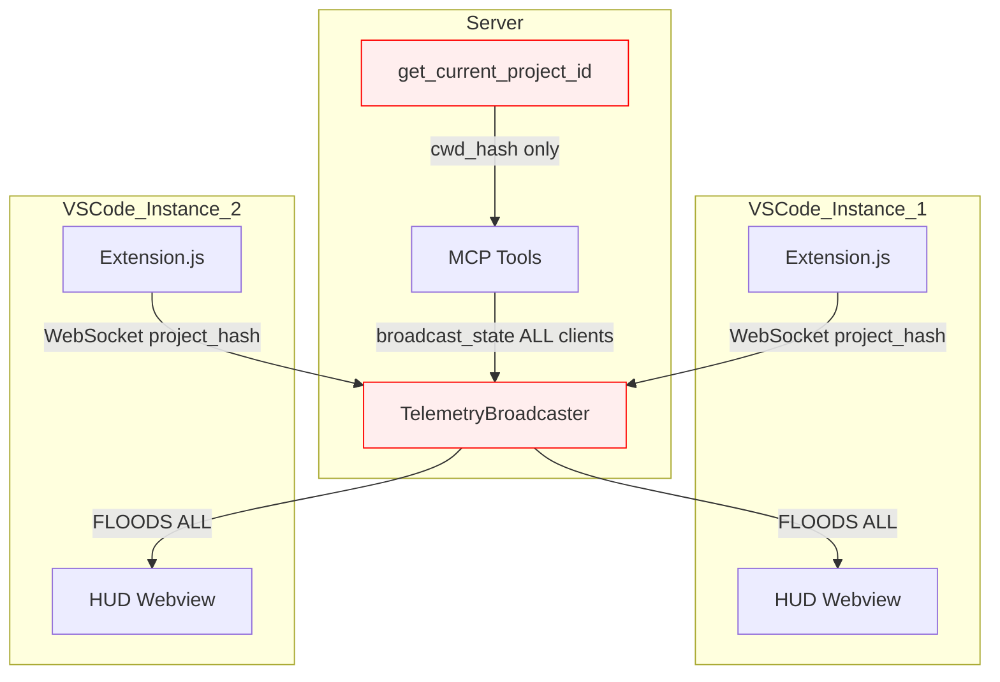
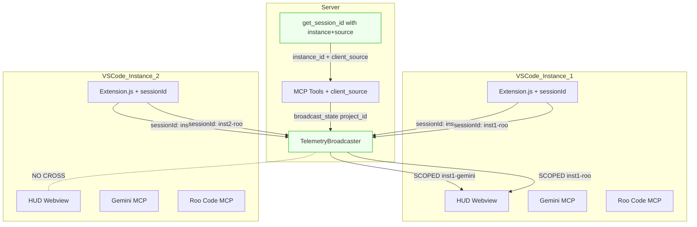
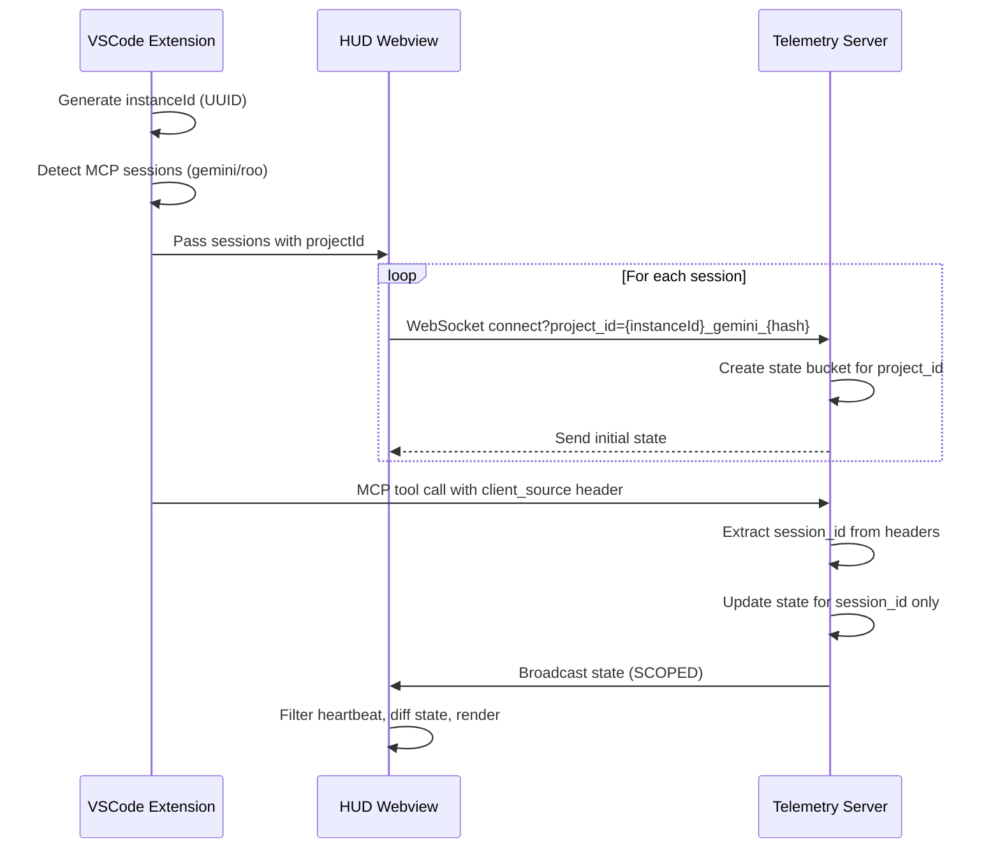
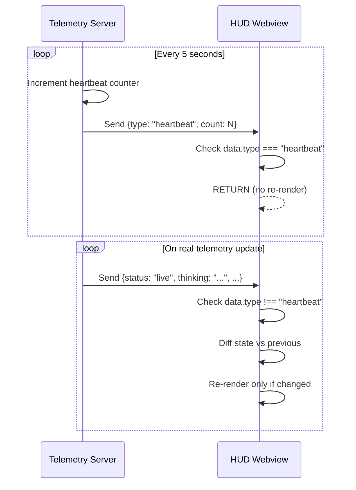

# HUD Telemetry Fix - Architectural Blueprint

**Generated by:** Lachman Protocol (qwen_architect)  
**Date:** 2026-03-28  
**Based on:** [.inbox/HUD_AUDIT_REPORT_2026-03-28.md](../.inbox/HUD_AUDIT_REPORT_2026-03-28.md)

---

## Executive Summary

**Goal:** Fix HUD (Specter Lens) telemetry system to properly isolate sessions by VSCode instance and client source (gemini vs roo code), and eliminate heartbeat-induced UI flickering.

**Manifest:** Refactor Specter Lens telemetry to enforce scoped session integrity.
- Core 80%: Generate unique sessionId per VSCode window using `vscode.env.sessionId` + clientType tag (gemini/roo)
- Decouple telemetry heartbeat logic from UI render cycle to eliminate flickering
- Implement state diffing before UI updates to prevent unnecessary redraws

**Audit Verdict:** 
- ✅ APPROVED: Scoped telemetry service per workspace
- ❌ VETO: Global singleton telemetry state (causes cross-window leakage)
- ❌ VETO: Direct UI updates on heartbeat tick (causes flicker)

---

## Current Architecture (As-Is)



**Problems:**
1. All instances with same workspace get same `project_id`
2. `broadcast_state()` sends to ALL clients regardless of project_id
3. Heartbeat triggers full React re-render every 5 seconds

---

## Target Architecture (To-Be)



**Key Changes:**
1. Unique `sessionId` per (instance, client_source) tuple
2. `broadcast_state()` respects project_id boundaries
3. Heartbeat messages have `type` field, filtered by UI

---

## Component Breakdown

### 1. Session Identity System

**File:** `src/qwen_mcp/specter/identity.py`

```python
def get_session_id(instance_id: str, client_source: str, cwd: str) -> str:
    """
    Generate unique session ID combining:
    - instance_id: Unique per VSCode window (UUID)
    - client_source: 'gemini' or 'roocode'
    - cwd: Workspace folder hash
    """
    workspace_hash = hashlib.sha256(cwd.encode()).hexdigest()[:8]
    return f"{instance_id}_{client_source}_{workspace_hash}"

def generate_instance_id() -> str:
    """Generate unique instance ID for this VSCode window."""
    return str(uuid.uuid4())[:8]
```

### 2. Telemetry Broadcaster (Scoped)

**File:** `src/qwen_mcp/specter/telemetry.py`

**Changes to `broadcast_state()`:**
```python
async def broadcast_state(self, payload: dict, project_id: str = "default") -> None:
    """Broadcasts state ONLY to clients of specified project_id."""
    async with self._lock:
        # Only update the specific project state
        if project_id in self._project_states:
            self._project_states[project_id].update(payload)
        
        # Only send to clients of THAT project
        if project_id in self._clients:
            clients = list(self._clients[project_id])
        else:
            clients = []
    
    # Send outside lock
    for client in clients:
        try:
            await client.send_text(json.dumps(self._project_states[project_id]))
        except Exception:
            async with self._lock:
                if project_id in self._clients:
                    self._clients[project_id].discard(client)
```

**Changes to `_send_heartbeat()`:**
```python
async def _send_heartbeat(self):
    """Send heartbeat with proper type field, skip broadcast_state."""
    self._heartbeat_counter += 1
    heartbeat_msg = {"type": "heartbeat", "count": self._heartbeat_counter}
    
    for project_id in list(self._clients.keys()):
        for client in list(self._clients[project_id]):
            try:
                await client.send_text(json.dumps(heartbeat_msg))
            except Exception:
                self._clients[project_id].discard(client)
```

### 3. VSCode Extension (Session Provider)

**File:** `vscode-extension/extension.js`

**Add instance ID generation:**
```javascript
function activate(context) {
    // Generate unique instance ID for this VSCode window
    const instanceId = vscode.env.sessionId || generateInstanceId();
    context.globalState.update('instanceId', instanceId);
    
    const provider = new SpecterViewProvider(context.extensionUri, instanceId);
    // ...
}

_detectMcpSessions(instanceId) {
    const sessions = [];
    
    // Gemini session
    if (hasQwenServer) {
        sessions.push({
            id: 'gemini',
            name: 'Gemini',
            projectId: `${instanceId}_gemini_${this._hashProjectId(workspace.name)}`,
            clientSource: 'gemini'
        });
    }
    
    // Roo Code session
    if (hasRooQwenServer) {
        sessions.push({
            id: 'roocode',
            name: 'Roo Code',
            projectId: `${instanceId}_roocode_${this._hashProjectId(workspace.name)}`,
            clientSource: 'roocode'
        });
    }
    
    return sessions;
}
```

### 4. React HUD UI (State Diffing)

**File:** `specter-lens-ui/src/App.tsx`

**Fix heartbeat filter:**
```typescript
ws.onmessage = (event) => {
    try {
        const data = JSON.parse(event.data);
        
        // FIX: Check for heartbeat type field
        if (data.type === 'heartbeat') return;
        
        // State diffing - only update if changed
        setSessions(prev => prev.map(s => {
            if (s.id === session.id) {
                const newTelemetry = { ...s.telemetry, ...data };
                newTelemetry.is_live = data.status === 'live' || data.status === 'processing';
                
                // Skip update if nothing meaningful changed
                if (JSON.stringify(newTelemetry) === JSON.stringify(s.telemetry)) {
                    return s;
                }
                return { ...s, telemetry: newTelemetry };
            }
            return s;
        }));
    } catch (e) {
        console.error("Failed to parse telemetry");
    }
};
```

### 5. MCP Tools (Client Source Propagation)

**File:** `src/qwen_mcp/tools.py`

**Add client_source parameter extraction:**
```python
from .specter.identity import get_session_id

async def qwen_sparring(ctx, prompt: str, client_source: str = "default"):
    """Sparring tool with proper session isolation."""
    # Extract client_source from MCP context if available
    if hasattr(ctx, 'request_context') and ctx.request_context:
        client_source = ctx.request_context.headers.get('X-Client-Source', 'default')
    
    # Generate proper session ID
    instance_id = os.getenv('QWEN_INSTANCE_ID', 'unknown')
    session_id = get_session_id(instance_id, client_source, os.getcwd())
    
    # Use session_id for all telemetry calls
    await broadcaster.start_request(project_id=session_id)
    # ...
```

---

## Data Flow

### Session Connection Flow



### Heartbeat Flow (Fixed)



---

## Risk Assessment

| Risk | Impact | Mitigation |
|------|--------|------------|
| Race conditions on window reload | Duplicate sessions | Add session cleanup on WebSocket close |
| Memory leaks from unclosed intervals | Extension slowdown | Clear intervals in `deactivate()` |
| Privacy violation via mixed session data | Data leakage | Strict project_id isolation in `broadcast_state()` |
| Backward compatibility break | Existing tools fail | Add fallback to "default" project_id |

---

## Implementation Roadmap

### Phase 1: Heartbeat Fix (P1 - Immediate)
- [ ] Fix `_send_heartbeat()` message format in `telemetry.py`
- [ ] Verify UI filter catches heartbeat messages
- [ ] Test: No flickering for 60 seconds

### Phase 2: Scoped Broadcast (P2 - Core)
- [ ] Fix `broadcast_state()` to respect `project_id`
- [ ] Add unit test for multi-client isolation
- [ ] Test: Two VSCode instances show different data

### Phase 3: Session Identity (P3 - Complete)
- [ ] Add `get_session_id()` function in `identity.py`
- [ ] Update extension.js to generate `instanceId`
- [ ] Update `App.tsx` WebSocket connection format
- [ ] Add `client_source` to MCP tool context
- [ ] Test: Gemini tab shows only Gemini data, Roo tab shows only Roo data

---

## Files to Modify

| File | Changes | Priority |
|------|---------|----------|
| `src/qwen_mcp/specter/telemetry.py` | Fix `broadcast_state()`, fix `_send_heartbeat()` | P1, P2 |
| `src/qwen_mcp/specter/identity.py` | Add `get_session_id()`, `generate_instance_id()` | P3 |
| `vscode-extension/extension.js` | Generate `instanceId`, update session format | P3 |
| `specter-lens-ui/src/App.tsx` | Fix heartbeat filter, add state diffing | P1 |
| `src/qwen_mcp/tools.py` | Add `client_source` parameter extraction | P3 |

---

## Test Verification Checklist

- [ ] Heartbeat messages in browser console show `type: "heartbeat"`
- [ ] Two VSCode instances with same workspace show different data
- [ ] `qwen_sparring` from Gemini shows in Gemini tab only
- [ ] `qwen_sparring` from Roo Code shows in Roo Code tab only
- [ ] No UI flickering during 5-minute observation
- [ ] Extension deactivate() cleans up all intervals
- [ ] WebSocket reconnect after server restart works correctly
